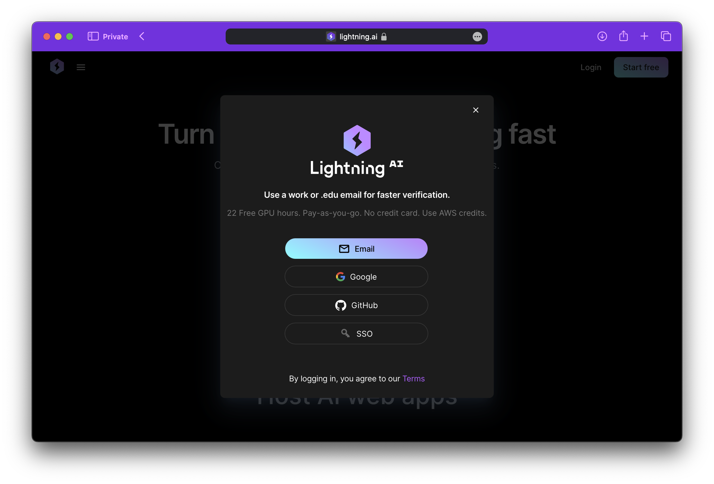
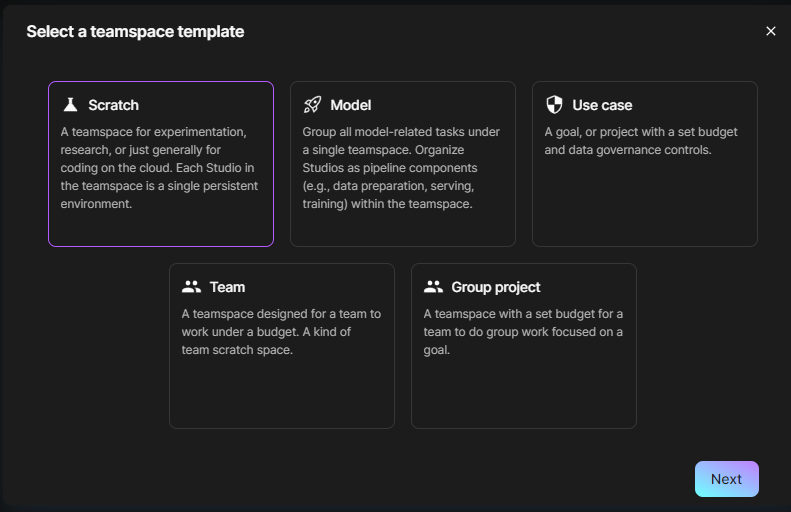
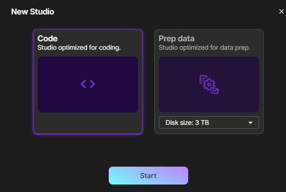
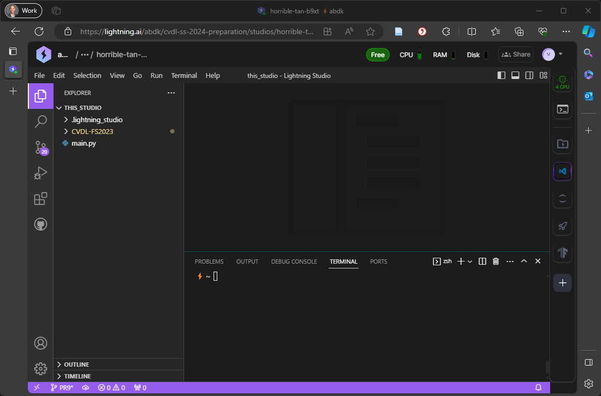
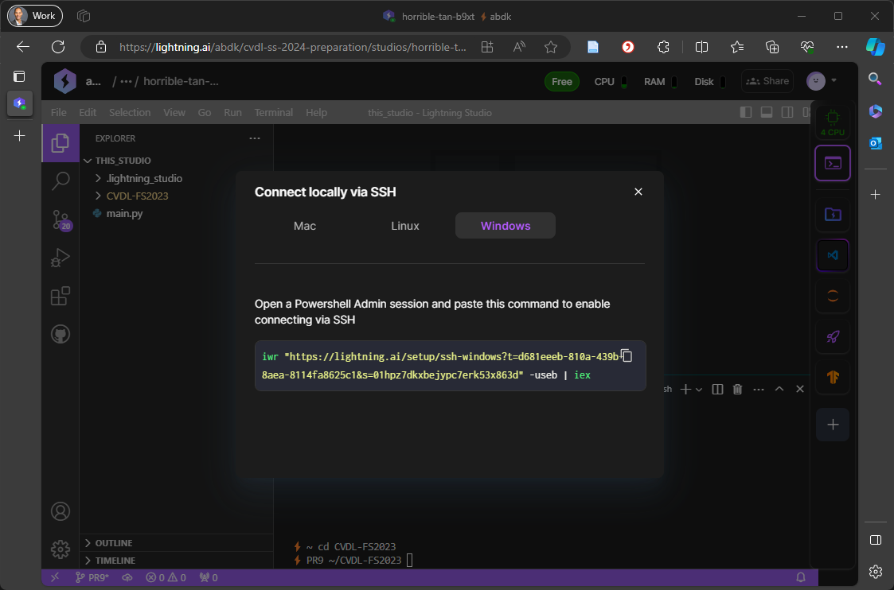
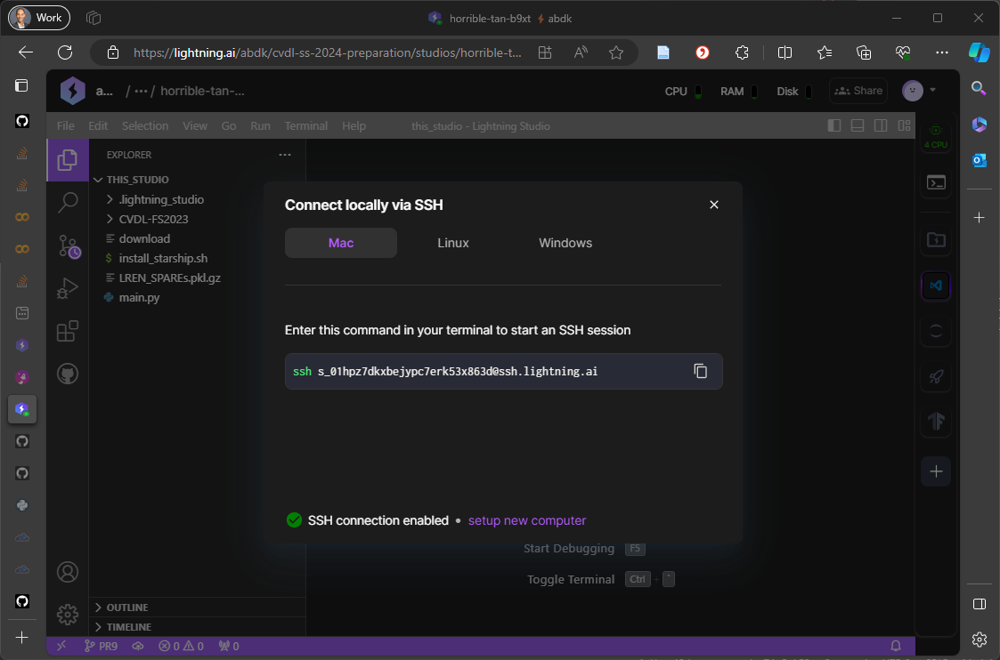
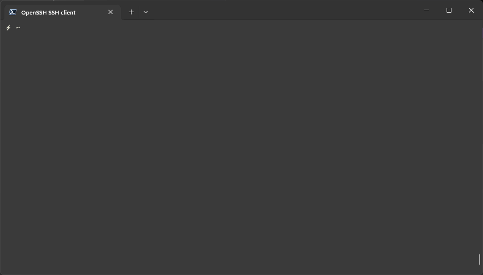
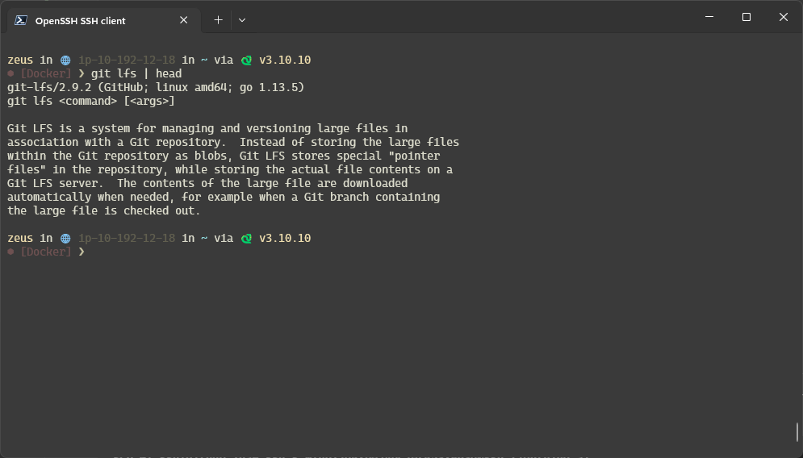

# Setup Instructions for Lightning AI

## Introduction

The Center for Artificial Intelligence @ ZHAW provides you with compute resources in the cloud. LightningAI allows you to edit your code in the browser or with your favourite IDE via a remote development environment. You will have access to a GPU and can run your code in the background. By the end of the setup, you will have an account set up, be part of the Course Org and assigned to a group.

## Prerequisites

We assume that you completed the first tutorial and have a running VScode
installation as well as created an SSH key for connecting to github.zhaw.ch.
Please sign in using your student email such that we can link it to the course.

## Step I: Register and Create an Account

Navigate to [https://lightning.ai](https://lightning.ai) and create an account. Provide your ZHAW
student email address and click on the link that you receive in your email.
The link directs you to your personal space on lightning.ai.



## Step II: Fill Out the Course Excel Sheet
Access MS Teams and navigate to the CVDL Team.
Open `Groups.xlsx` Excel sheet under `General > Files`.
Join a group and enter your name as well as your `lightning.ai` username.
The course instructor or teaching assistent will review the Excel sheet and
assign you to a group in Lightning AI based on the information you provided.

Note: you might need to log off and on again in order to see the CVDL group.

You can continue with the next steps using the free tier account.

## Step III: Get to know the Lightning AI interface

### Create a teamspace and new studio

Since this is just for testing, you can use a free tier account. Create a
teamspace and name it appropriately by clicking on the `+` symbol next to
`Teamspaces` in the left column.
Choose the `Scratch` template and click on `Next`.
Set a name for the teamspace and click on `Create`.



This will lead to a dialog where you can create a new studieo.
Select `Code` and click on `Start`.
Note, that you can only have
a single running teamspace at a time in the free tier.




Once started, the studio should look something like this:



You can select the resources you need, including
the number of GPUs and the amount of memory. Select the the default (free)
configuration with 4 CPU cores.
When you return to the session after a break, click on the name of the studio
to start it.
The studio will persist over time and you can continue working on your code.

### Connect to the studio via SSH

Click on the Terminal icon on the right of the studio, then on `Connect via SSH`.
This will show you the SSH command to create an SSH key depending on the OS.
Copy the command and run it in your local terminal. This will create a new SSH
key and configure it to connect to the studio.



The diolog will also show you the command to connect to the studio via SSH.
Copy the command and run it in your local terminal.



You are now connected to the studio.

> **_NOTE_**
> Write down the studio identifier as it's unique for each studio you create.
```shell
# lightning UID format
ssh <YOUR-STUDIO-UID>@ssh.lightning.ai
```



You can now install software like `git-lfs` and a nice prompt in the studio as
we will need this later on.

```shell
sudo apt install git-lfs
```

The starship prompt is a nice addition to the terminal.
This step is optional and requires requires a compatible terminal application
and fonts.
See [Starship](https://starship.rs/) for more information.

```shell
# Optional installation of the Starship prompt
curl -sS https://starship.rs/install.sh > install_starship.sh
mkdir -p ~/.local/bin
sudo sh install_starship.sh --force --bin-dir ~/.local/bin
echo 'eval "$(~/.local/bin/starship init bash)"' >> ~/.bashrc
echo 'eval "$(~/.local/bin/starship init zsh)"' >> ~/.zshrc
rm install_starship.sh
```

When you login next time or open a new shell, you should have a nice prompt and
`git-lfs` installed.



## Step IV: Copy your ZHAW Github SSH key to the studio

To access the course repository, you need to copy your ZHAW Github SSH key to
the studio. You can do this by running the following command in your local
terminal (replace `github.zhaw` with the name of your SSH key and
the cryptic user name with the one given by lightning.ai):

```shell
# run this command on your local machine
scp ~/.ssh/<YOUR-PRIVATE-KEY> <YOUR-STUDIO-UID>@ssh.lightning.ai:/teamspace/studios/this_studio/.ssh
```

Make sure to remove read and write permissions for group and others from the
file `~/.ssh/<YOUR-PRIVATE-KEY>`. This step needs to be repeated each time a studio
is launched.

```shell
# run this command on the lightning instance
chmod og-rwx ~/.ssh/<YOUR_PRIVATE_KEY>
echo -e "Host github.zhaw.ch\n\tUser git\n\tHostName github.zhaw.ch\n\tStrictHostKeyChecking no\n\tIdentityFile ~/.ssh/<YOUR_PRIVATE_KEY>" >> ~/.ssh/config
```

By default, the permission of the SSH key are reset after a stopping the
studio. To avoid this, you can configure the startup script to set the correct
permissions.

```shell
echo "chmod og-rwx ~/.ssh/<YOUR_PRIVATE_KEY>" >> ~/.lightning_studio/on_start.sh
```

## Step V: Clone the course repository

Connect to the studio via SSH and clone the course repository. This will also
install the course package and its dependencies.
Note, in a LightningAI studio, only one conda environment is allowed. Therefore,
we install the course package in the base environment.

```shell
# Clone
GIT_LFS_SKIP_SMUDGE=1 git clone git@github.zhaw.ch:CVDL/CVDL_BSc.git
# Change into the repository
cd CVDL_BSc
# Get images from Git LFS storage
git lfs pull --include "*.png" --include "*.gif"
# Install the course package and dependencies
python -m pip install -r requirements.txt
```

## Step VI: Run tutorial code on Lightning AI

You can now run the tutorial code in the studio.
If you have credits for a GPU, restart the studio and select a GPU
configuration to run the code wih accelerated hardware.
Note, your connection will be lost when you restart the studio.
