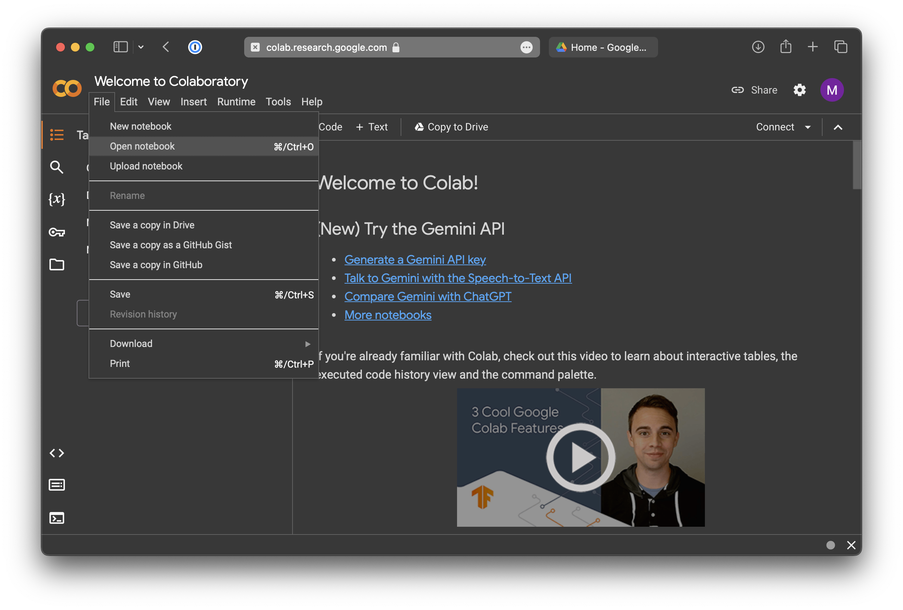

# Setup Instructions for Google Colab

## Introduction

Alternatively to using LightningAI, you can also run your code on the Google Colab platform.
> **_NOTE_**
> the labs in this course are provided as python scripts, so you will need to transform them into a notebook yourself.

## Step I: Create an Account

Navigate to [https://colab.research.google.com](https://colab.research.google.com) and create a Google account.

## Step II: Fill Out the Course Excel Sheet

Access MS Teams and navigate to the CVDL Team.
Open `Groups.xlsx` Excel sheet under `General > Files`.
Join a group and enter your name. You can leave the `lightning.ai` username blank if you intend to work with colab.

## Step III: Create a ZHAW GitHub Access Token

In order to install the course package with pip inside colab, you need an access token. Head to [https://github.zhaw.ch](https://github.zhaw.ch) and create a token under Settings > Developer settings > Personal access tokens > Tokens (classic).
> **_NOTE_**
> The `repo` checkbox needs to be enabled in order to load the package.
> 

## Step IV: Working with Notebooks

### Create a Notebook

Open colab and create a new notebook. You can install the course package by putting the following commands inside the first cell of your notebook.
```python
!python -m pip uninstall -y lida torchtext matplotlib torch torchdata
!GIT_LFS_SKIP_SMUDGE=1 python -m pip install git+https://<YOUR-GIT-TOKEN>:x-oauth-basic@github.zhaw.ch/CVDL/CVDL_BSc.git
from cvdl.datasets.oxfpets.oxfpetsdataset import OxfordPets
```
Keep in mind that you will need to run this every time you run a new colab session.

> **_NOTE_**
> your Notebook is saved automatically in your [Google Drive](https://drive.google.com/drive/home) by default. To access a previously saved notebook, click on `File` > `Open`.
> 

### Change runtime
By default, google allocates you a CPU instance. To switch to a GPU, connect to an instance normally by clicking the `connect` button. Open the `Additional Connection Options` dropdown and select `Change Runtime Type`.


## Step V: Run tutorial code on Colab

You can now run the tutorial code in the notebook. copy the `quickstart.py` script from the local setup tutorial.