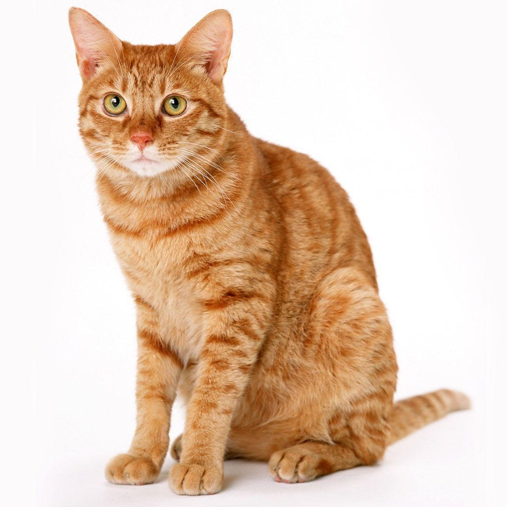
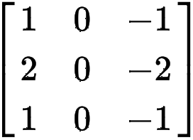
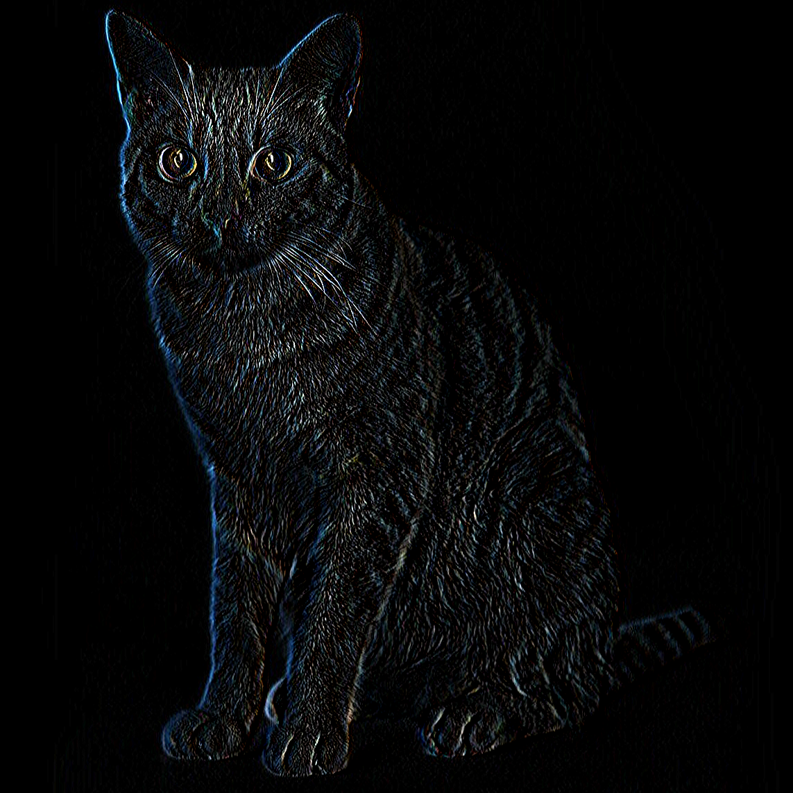

# 03 Convolutions

## Introduction

In this tutorial, you will learn about the mathematical operation that lies at
the heart of CV known as a convolution.
this operation allows us to:
- Extract features
- down-/upscale images
- implement image transformations
- detect patterns and textures
- ...

## I: What is a Convolution?
Generally, a convolution is a mathematical operation that combines
twofunctionsto produce a third, showing how the shape of one is modified by
theother. Inthe context of CV, convolutions involve applying a *kernel* (also
knownas afilter) to an image in order to extract features from it. This kernel
is asmallmatrix that slides over the image pixels and
performselement-wisemultiplication with the part of the image it covers, summing
upthese productsinto a single output pixel in the feature map.

- [animated video explaination convolution algorithm](https://www.youtube.com/watch?v=eMXuk97NeSI)

The gif below showcases how the input pixels (blue) relate to the output pixels
(cyan) trough the convolution. Note that the output gets smaller trough the
convolution.


## II: Why are Convolutions Fundamental?
The power of convolutions lies in its simplicity and efficiency. This simple
operation can perform a multitude of tasks such as:
- **Edge Detection:** By highlighting sharp changes in intensity, we can outline
the boundaries of objects within an image.
- **Blurring:** By smoothing transitions in intensity, we create a blur effect
that can reduce noise or detail.
- **Sharpening:** By enhancing the contrast between adjacent pixels, we can make
images appear more crisp and defined.

These capabilities make convolution an indispensable tool in preprocessing
images for analysis, enhancing or extracting information, image recognition and
more.


Example: edge detection with a sobel filter:
| Original | Sobel Kernel | Convolved |
|:--------:|:------------:|:---------:|
 |  | 

## III: Convolutions in Deep Learning
Unlike traditional feedforward neural networks (FFNNs) that process inputs as
flat, one-dimensional vectors, CNNs maintain the spatial hierarchy and structure
of the input data, meaning pixels that are close to each other in the input are
close to each other in in output.

### Learning Spatial Hierarchies

The core component of CNNs is the convolutional layer, which applies convolution
operations as described earlier. But what does the network learn through these
convolutions?

- **Feature Hierarchies**: In the initial layers, the network learns torecognize
simple patterns and textures, such as edges and colors. As we movedeeper into
the network, the layers start recognizing more complex structures,combining the
simple patterns into more elaborate features like shapes orspecific objects
parts.

- **Localized Feature Detection**: Unlike FFNNs, which consider the entire image
at once, convolutional layers focus on small, local regions of the input image.
This approach allows the network to detect features regardless of their position
in the image, leading to a property known as translation invariance.
Essentially, once the network learns to recognize a feature in one part of the
image, it can recognize the same feature anywhere.

### Key Parameters in Convolutional Layers

Convolutional layers are defined by several key parameters that significantly
influence their operation:

- **Kernel Size**: The size of the filter used in the convolution operation. A
larger kernel size means that the convolution will encompass a larger area of
the input image, capturing more global features. Conversely, a smaller kernel
size focuses on more localized features. Common choices are 3x3, 5x5, 1x1.

- **Stride**: The stride determines how many pixels the kernel moves across the
image after each operation. A stride of 1 means the kernel moves one pixel at a
time, leading to a detailed feature map. Larger strides reduce the spatial
dimensions of the output feature map, which can be useful for downsampling.

- **Padding**: Padding involves adding layers of pixels around the input image
to allow the convolution operation to be applied to the border pixels. This
allows the output to be the same size as the input. Take a look at [pytorchs pad
function](https://pytorch.org/docs/stable/generated/torch.nn.functional.pad.html)
to see how you can pad an image.

- **Dilation**: Dilation controls the spacing between the kernel elements. A
dilation of 1 means no dilation, i.e. a standard convolution. A higher dilation
value increases the kernel's field of view by introducing gaps in the kernel
application. For example, a 3x3 kernel with a dilation of 2 will have the same
field of view as a 5x5 kernel but still only uses 9 parameters.

| normal convolution | padding | stride | dialation |
|:--------:|:------------:|:---------:|:---------:|
 | |  | 

## IV: Utilizing `torch.nn.Conv2d` in PyTorch

In PyTorch, the `torch.nn.Conv2d` module allows us to easily implement
convolutional layers with the mentioned parameters. Here's a brief overview of
how to use it:

```python
import torch.nn as nn

# Define a convolutional layer
conv_layer = nn.Conv2d(in_channels=1, out_channels=32, kernel_size=3, stride=1, padding=1)

# Example input: A batch of grayscale images (batch size, channels, height, width)
# For a single image: (1, 1, 28, 28)
input_image = torch.randn(1, 1, 28, 28)

# Apply the convolutional layer
output_feature_map = conv_layer(input_image)
```

In this example, `in_channels` refers to the number of channels in the input
image (1 for grayscale, 3 for RGB), `out_channels` is the number of filters
applied (and thus the number of feature maps generated), `kernel_size` is the
size of the kernel, `stride` controls the stepping of the convolution across the
image, and `padding` ensures the output size can be controlled.

## V: Your Turn

- Take a look at Edward Z. Yangs [Convolution
Visualizer](https://ezyang.github.io/convolution-visualizer/index.html) where
you can modify the convolution parameters and observe theyr effect on the output.
- Run the `conv2d.py` script. Try out different kernel sizes, parameters and kernels.


## Further Resources
- [AnimatedAI videos](https://www.youtube.com/@animatedai/videos)
- [But what is a convolution?](https://www.3blue1brown.com/lessons/convolutions)
- [Intuitively Understanding Convolutions for Deep Learning](https://towardsdatascience.com/intuitively-understanding-convolutions-for-deep-learning-1f6f42faee1)
- [A guide to convolution arithmetic for deep learning](https://arxiv.org/abs/1603.07285)